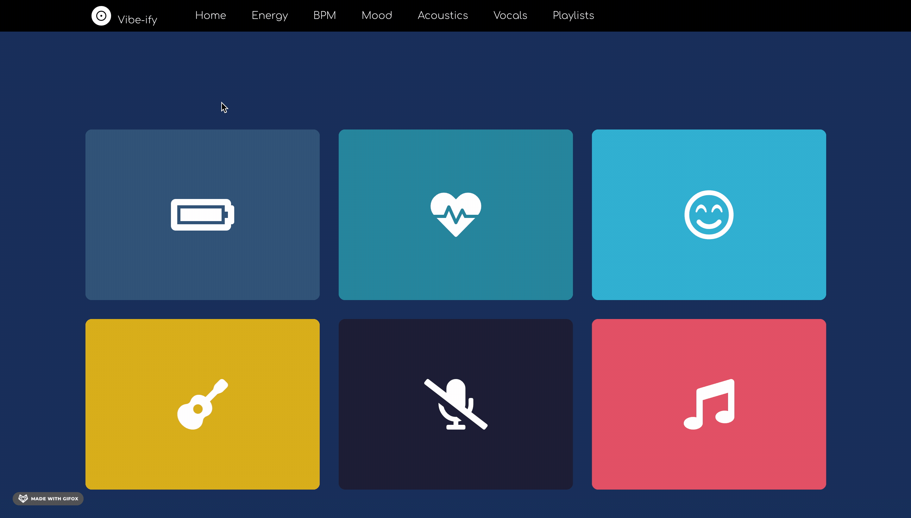

## About The Project

This application uses the Spotify API and creates a user interface for users to fine tune the recommendations they receive from Spotify by selecting a range of values for serveral various parameters nad then choosing up to 5 genres of music to go along with the parameter they choose to filter by.

### Built With

* [React](https://reactjs.org)
* [Express](http://expressjs.com/)
* [Axios](https://www.npmjs.com/package/axios)


<!-- GETTING STARTED -->
## Getting Started

This is an example of how you may give instructions on setting up your project locally.
To get a local copy up and running follow these simple example steps.

### Prerequisites

This is an example of how to list things you need to use the software and how to install them.
* npm
  ```sh
  npm install npm@latest -g
  ```

### Installation and starting the project

1. Get a free client id and client secret at [https://developer.spotify.com/](https://developer.spotify.com/)
2. Clone the repo
   ```sh
   git clone https://github.com/stevennguyen21/Vibe-ify
   ```
3. Install NPM packages
   ```sh
   npm install
   ```
4. Enter your client Id and client secret in `config.js`
   ```JS
   const API_KEY = 'ENTER YOUR API';
   ```
5. Cd into the authserver folder and run the command node web-api-auth-examples/authorization_code/app.js 
6. open a new terminal and cd into the client folder of the app folder and run npm start
7. goto localhost:8888 on your browser


<!-- USAGE EXAMPLES -->
## Usage



<!-- CONTACT -->
## Contact

Steven Nguyen - [@linkedin.com/in/stevennguyen44](https://linkedin/com/in/stevennguyen44) - steeven.nguyen1102@gmail.com

Project Link: [https://github.com/stevennguyen21/Vibe-ify](https://github.com/stevennguyen21/Vibe-ify)

